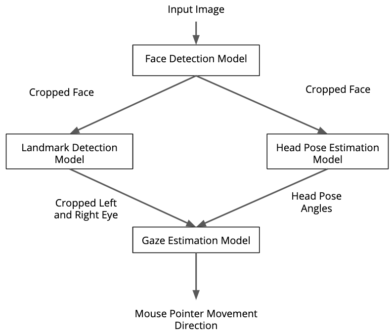

# Computer Pointer Controller


Human vision performs a variety of tasks to interpret the surrounding environment. Many of them have been researched and automated by deep learning. This project combines several such models from the Intel Distribution of OpenVINO Toolkit to control a mouse pointer using eye gaze. The first step is to identify faces and extract a face from an input video stream captured from a webcam or a video file. Then we extract facial landmarks and find the orientation of the face by means of a head pose estimation model. Knowing the head pose and facial landmarks, we can find the orientation of the eye gaze using a gaze estimation model. Finally, the mouse pointer is moved in the direction of the eye gaze. 

The project coordinates the flow of data from the input, and then amongst the different models and eventually to the mouse controller. The flow of data looks like this:


## Project Set Up and Installation

### Install the Intel Distribution of OpenVINO Toolkit

The project requires Intel OpenVINO 2020.1 or newer. Older versions should work too, but it's not guaranteed.
Refer to [this](https://docs.openvinotoolkit.org/2020.1/_docs_install_guides_installing_openvino_linux.html#install-openvino) manual for a step-by-step installation guide.


### Install Python libraries

Creating an isolated environment for the project is recommended. It can be done by the following command:
```
conda create -n computer-pointer-controller python=3.6
``` 

Now activate the environment:
```
conda activate computer-pointer-controller
```

To install necessary Python packages run:
```
pip install -r requirements.txt
```

### Download pre-trained models from OpenVINO Model Zoo

The project requires the following models:
* face-detection-retail-0005
* facial-landmarks-35-adas-0002
* head-pose-estimation-adas-0001
* gaze-estimation-adas-0002

Model files are expected to reside in <project-folder>/models.

For convenience there is a download_models.sh script in the project root folder which automatically installs the OpenVINO Model Downloader requirements and downloads all the necessary models. Assuming that OpenVINO is installed to the default location, simply run:
```
./download_models.sh
```

In case OpenVINO is installed to a different path, the script should be provided with a Model Downloader directory as an argument:
```
./download_models.sh /opt/intel/openvino/deployment_tools/tools/model_downloader
```

Alternatively, these models can be downloaded via Model Downloader (<OPENVINO_INSTALL_DIR>/deployment_tools/open_model_zoo/tools/downloader) one-by-one:
```
./downloader.py --name face-detection-retail-0005 --precisions FP32,FP16,FP32-INT8 --output_dir <project-folder>/models
./downloader.py --name facial-landmarks-35-adas-0002 --precisions FP32,FP16,FP32-INT8 --output_dir <project-folder>/models
./downloader.py --name head-pose-estimation-adas-0001 --precisions FP32,FP16,FP32-INT8 --output_dir <project-folder>/models
./downloader.py --name gaze-estimation-adas-0002 --precisions FP32,FP16,FP32-INT8 --output_dir <project-folder>/models
```

Consult [this](https://docs.openvinotoolkit.org/2020.1/_tools_downloader_README.html) page for additional details about OpenVINO Model Downloader usage.

### Project directory structure

The project tree should finally look like this:
```
├── bin
│   └── demo.mp4
├── download_models.sh
├── models
│   └── intel
│       ├── face-detection-retail-0005
│       ├── facial-landmarks-35-adas-0002
│       ├── gaze-estimation-adas-0002
│       └── head-pose-estimation-adas-0001
├── README.md
├── requirements.txt
└── src
    ├── face_detection.py
    ├── facial_landmarks_detection.py
    ├── gaze_estimation.py
    ├── generic_model.py
    ├── head_pose_estimation.py
    ├── helpers.py
    ├── input_feeder.py
    ├── main.py
    └── mouse_controller.py
```    


## Demo

Before launching the app make sure to activate the project's virtual environment (see "Project Set Up and Installation" section for guidelines on creating the virtual environment). Also you need to have OpenVINO initialized. Assuming the default installation path, it can be done by this command:
```
source /opt/intel/openvino/bin/setupvars.sh -pyver 3.6
```

The main script is located in the _src_ folder. In order to run the application you need to provide the input file:
```
python main.py --input ../bin/demo.mp4
```

Or you can use a webcam stream:
```
python main.py --input cam
```

Other command line arguments are optional. See the "Documentation" section for details.


## Documentation

The following table lists the command line arguments supported by the application.

| Parameter         | Explanation |
|-------------------|-------------|
|  -h, --help       | Shows the help message and exits |
|  --input INPUT    | An input file name or 'cam' to capture input from a webcam. |
|  --device DEVICE  | Device name to perform inference on. Defaults to CPU. |
|  --ext EXT        | Specifies the extension to use with the device. |
| --precision PRECISION | Specifies the model precision to use: FP32, FP16, or FP32-INT8. Default is FP32. |
| --concurrency CONCURRENCY | Defines the number of concurrent requests each model can execute. Pass zero for synchronous inference. Default is 1. |
|  --confidence CONFIDENCE | Specifies face detection probability threshold. Must be in range from 0 to 1. Default is 0.5. |
|  --failsafe       | Enables the fail-safe feature of PyAutoGUI. By default, it's disabled. |
|  --clean          | Enables visualization of intermediate model outputs. Active by default. |
|  --stats          | Prints per-layer performance statistics. Disabled by default. |
|  --silent         | Enables the silent mode when video output and the mouse control feature are disabled. Useful for performance measurement. Disabled by default. |
|  --speed SPEED    | Controls the mouse speed. Possible values: fast, slow, medium. Default is medium. |
|  --log LOG        | Specifies the log file. Leave it empty to print log messages to the console (default behavior). |

## Benchmarks

This project can use models in three precisions: FP32, FP16, and FP32-INT8. The only harware available to me is Core i7 4712HQ (4th gen, not officially supported by OpenVINO), so the benchmark includes only CPU results. The table below shows the processing time (in seconds) for different combinations of model precisions and levels of concurrency (see the "Async Inference" section for concurrency implementation details).

|                 | FP32  | FP16  | FP32-INT8 |
|-----------------|-------|-------|-----------|
| Synchronous (0) | 15.87 | 17.43 | 25.49     |
| Asynchronous (1)| 12.54 | 12.59 | 17.76     |
| Asynchronous (2)| 12.67 | 15.28 | 18.54     |
| Asynchronous (4)| 12.5  | 12.19 | 17.57     |


These results have been obtained in the silent mode (without video output and mouse control) using the "demo.mp4" input file. This way we minimize the delays caused by PyAutoGUI and OpenCV, so the processing time is dominated by the inference time. Each test was run 3 times, the measured time was then averaged. Model loading time for FP32 and FP16 precisions was around 1 second. For FP32-INT8 it took around 4.5 seconds.


## Results

These benchmark results suggest that models in FP32 precision work faster on my hardware (CPU). This is probably because CPU is optimized for FP32 precision. Lower precision models may incur computational overhead connected with internal upscaling to FP32. However, on different hardware lower precision models may show better performance due to reduced memory usage and faster data transfer. 

Another point to notice is asynchronous inference, which improves performance regardless of the precision used. That said, increasing the number of parallel requests per model (shown in braces) does not seem to speed up things further. This is again hardware-dependent: Xeon processors and newer Core processors are likely to be capable of doing more requests simultaneously. 

As far as accuracy is concerned, no visible differences were noticed between FP32, FP16, and FP32-INT8 models.


## Stand Out Suggestions

The application benchmarks the time it takes to run different parts of the inference pipeline by means of the get_perf_counts API. Specify the `--stats` command line argument to print the execution time for each model layer:
```
python main.py --input ../bin/demo.mp4 --stats
```

In case we are interested in statistics only, the camera feed and mouse controller can be disabled. This is called a silent mode, which can be activated by the `--silent` parameter:
```
python main.py --input ../bin/demo.mp4 --stats --silent
```
It eliminates the delays caused by the mouse controller and GUI event handling (e.g. OpenCV's waitKey). As a consequence, processing an input video file on the test machine takes about 10 times less time in the silent mode as compared to the normal GUI mode with a mouse controller on a medium speed. This is due to the fact that the mouse controller animation takes the most time.


Both synchronous and asynchronous inference modes are implemented in the project. In addition to that, the number of asynchronous requests can be controlled by the `--concurrency` parameter:
```
python main.py --input cam --concurrency 4 
```

Set concurrency to zero to disable the asynchronous mode: 
```
python main.py --input cam --concurrency 0
```

See the "Async Inference" sections for more details about concurrency implementation.


### Async Inference

The application can run inference in the synchronous and asynchronous modes. In the synchronous mode program execution cannot continue until inference request is completed. In the asynchronous mode the program can continue without waiting for inference results as long the number of simultaneous inference requests does not exceed a certain limit. This limit is controlled by the concurrency parameter. When concurrency is 0, the inference flow works in the synchronous mode. Concurrency greater than zero enables asynchronous mode where each model can execute the number of parallel requests equal to the concurrency parameter value. By default, the concurrency is 1, which means all four models (face detector, eye detector, head pose estimator, and gaze direction estimator) can run in parallel, but a single model can use only one request at a time. 

The "Benchmarks" section shows that asynchronous inference improves performance as compared to the synchronous mode. Increasing the number of concurrent requests per model to values greater than 1 did not show a tangible difference in performance on the test CPU.


### Edge Cases

The app needs exactly one face to appear in a frame. If there are many, it picks the first one which has a detection confidence not less than a threshold value. In case a face cannot be confidently detected, this frame is not used for mouse control (the output window shows the original frame and the mouse pointer's position remains the same). Possible reasons for detection to fail are bad lighting (too dark or too bright), angle shot, face occlusion. Eyeglasses can make detections less accurate. In my tests it proved to work fine with transparent glasses. However, if a person is wearing sunglasses, there is no way to estimate the gaze direction.

Another caveat is that bounding boxes are occasionally empty (have zero width or height). It may happen when a face is too far away from the camera or a head is turned by a wide angle. Empty bounding boxes are likely to cause crashes and hence are treated the same way as detection failures. Asynchronous inference makes handling of failures more difficult since results are not tested for validity immediately after inference call, but they must come out in the same sequence as input frames. To tackle this, there is a processing queue which contains the original frames along with corresponding intermediate model outputs. Once the intermediate output is available (either valid or invalid), it is mapped onto the corresponding frame. Finally, when a gaze vector is produced the result is checked for validity. This way we avoid skipping of input frames (skipping can make video output not smooth when several detection failures occur in a row). As a consequence, each model in the inference pipeline must be ready to handle invalid inputs and pass them through obeying the order of results. 

